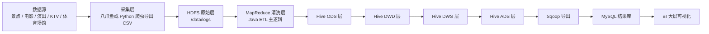

# 基于Hadoop的北京娱乐方式离线数仓与BI可视化详细项目文档

## 1. 项目概述

### 1.1 项目名称

基于 Hadoop 的北京娱乐方式离线数仓与 BI 可视化分析平台

### 1.2 项目定位

本项目属于典型的离线数仓类毕业设计，核心目标不是开发传统的前后端管理系统，而是围绕北京娱乐方式相关数据，完成从数据采集、原始数据入湖、离线清洗、数仓分层建模、指标汇总到 BI 可视化展示的完整闭环。项目最终交付内容以 Hadoop 生态上的离线处理流程、MySQL 结果库以及 BI 大屏为主，不单独建设 Spring Boot + Vue 网站。

### 1.3 项目主题

围绕北京地区的娱乐方式数据进行分析，数据主题建议固定为以下五类：

- 景点数据
- 电影数据
- 演出数据
- KTV 数据
- 体育场馆数据

选择这五类主题的原因是数据源容易获取，字段结构相对稳定，既能体现“北京娱乐方式”这一论文题意，也便于设计多个具有展示价值的统计指标。

### 1.4 最终需求确认

根据补充沟通内容，本项目后续实施必须严格遵守以下约束：

- 项目必须做成离线数仓项目，不做实时处理。
- 不使用 Flume 拦截器，不使用 HBase，不使用 Azkaban。
- 核心技术栈固定为 HDFS、MapReduce、Hive、Sqoop。
- 数据清洗主逻辑必须使用 Java 实现，优先采用 Java MapReduce。
- 除原始数据采集环节外，不再使用 Python 参与清洗、转换、分析和可视化。
- 可视化只做 BI 面板，不单独开发 Web 前端。

其中需要特别说明的是，Hive 和 Sqoop 属于平台层工具，本身分别负责数仓建模统计和结果导出，不属于“使用 Python 替代 Java”的范畴。项目中的业务处理代码、清洗逻辑和入湖逻辑仍以 Java 为主线。

## 2. 项目建设目标

### 2.1 总体目标

构建一个基于 Hadoop 生态的北京娱乐方式离线数仓，实现多源娱乐数据的统一接入、清洗、存储、分析和可视化展示，为北京娱乐方式的区域分布、价格分布、评分分布、售票状态和热门类型等主题提供数据支撑。

### 2.2 具体目标

- 完成北京娱乐方式数据的采集和原始数据归档。
- 使用 Java 程序将原始文件上传至 HDFS 指定目录。
- 使用 Java MapReduce 实现原始数据清洗、去重、字段标准化和业务口径统一。
- 基于 Hive 完成 ODS、DWD、DWS、ADS 四层离线数仓建模。
- 使用 Sqoop 将 ADS 结果表导出到 MySQL。
- 使用 BI 工具完成可视化大屏搭建。
- 形成可用于论文和答辩的完整技术文档、流程图和指标说明。
- 确保除采集环节外，不引入 Python 参与数据处理主流程。

## 3. 项目范围与裁剪说明

### 3.1 保留的核心技术栈

为保证项目口径统一、便于答辩，同时符合“除爬虫外全部使用 Java”的要求，项目保留以下核心技术：

- Linux 或 CentOS 7 环境
- Hadoop
- HDFS
- MapReduce
- Hive
- Sqoop
- MySQL
- BI 可视化工具
- Java

同时约定：

- 原始数据采集可以使用八爪鱼，必要时也可以使用 Python 爬虫。
- 进入 Hadoop 平台后的上传、清洗、分层、汇总和导出过程不再使用 Python。
- Hive 负责建表、分层和统计，MapReduce 负责数据清洗主流程。

### 3.2 明确不做的部分

为了避免项目偏离离线数仓主题，本项目不建设以下内容：

- 不做 Spring Boot 后端业务系统
- 不做 Vue 或 React 前端页面
- 不做实时流式计算
- 不以 Docker 作为答辩主线
- 不使用 Python 进行清洗、转换、分析和可视化

### 3.3 明确删除组件说明

老师给出的模板文档中包含 HBase、Flume、Azkaban 等组件，但结合当前确认要求，本项目采用“离线数仓最小闭环方案”，以下组件明确不纳入实际实现范围。

- HBase：本项目为离线统计分析场景，不需要高并发随机读写，因此不纳入实际落地范围。
- Flume：本项目数据以离线采集文件为主，不做日志实时采集，因此不纳入实际实现。
- Azkaban：本项目可以使用 shell 脚本手动调度或简化展示，不作为核心实现模块。

项目答辩时应强调：本课题属于离线数仓设计，技术重点在于 HDFS、MapReduce、Hive、Sqoop 与 BI 的闭环，而不是全生态组件堆砌。

## 4. 总体架构设计

### 4.1 架构分层

系统整体采用“数据采集层、数据存储层、数据处理层、数据仓库层、数据服务层、数据可视化层”六层架构。



### 4.2 各层职责说明

| 层级 | 主要职责 | 关键技术 |
|------|----------|----------|
| 数据采集层 | 获取各类娱乐数据并导出 CSV 文件 | 八爪鱼、Python 爬虫 |
| 数据存储层 | 存放原始文件和清洗结果 | HDFS |
| 数据处理层 | 去重、清洗、格式统一、字段解析 | Java、MapReduce |
| 数据仓库层 | 分层建模与主题统计 | Hive |
| 数据服务层 | 结果表导出与查询支撑 | Sqoop、MySQL |
| 可视化层 | 指标展示和交互分析 | BI 工具 |

## 5. 数据源设计

### 5.1 数据源选择原则

- 必须与“北京娱乐方式”主题直接相关
- 能够获取区域、类型、价格、评分或状态等可分析字段
- 结构相对稳定，便于后续清洗
- 允许通过离线导出方式保存为 CSV

### 5.2 主题数据说明

#### 5.2.1 景点数据

主要字段建议包括：

- 景点名称
- 所在区域
- 地址
- 简介
- 开放时间
- 门票价格
- 建议游玩时长
- 最佳游玩时间

#### 5.2.2 电影数据

主要字段建议包括：

- 电影名称
- 评分
- 类型
- 国家地区
- 导演
- 主演
- 简介

#### 5.2.3 演出数据

主要字段建议包括：

- 演出名称
- 演出时间
- 演出场馆
- 所在区域
- 票价区间
- 售票状态

#### 5.2.4 KTV 数据

主要字段建议包括：

- KTV 名称
- 所在区域
- 地址
- 评论数量
- 人均消费
- 服务评分
- 环境评分
- 综合性价比

#### 5.2.5 体育场馆数据

主要字段建议包括：

- 场馆名称
- 场馆类型
- 所在区域
- 地址
- 评分
- 评论数量
- 人均消费

### 5.3 数据落地格式

所有采集结果统一保存为 UTF-8 编码 CSV 文件，并按主题分别命名。例如：

- `scenic_raw.csv`
- `movie_raw.csv`
- `show_raw.csv`
- `ktv_raw.csv`
- `sport_raw.csv`

## 6. 数据采集与入湖方案

### 6.1 数据采集方案

考虑到部分网站存在反爬限制，本项目采集层建议采用离线导出优先的方式：

- 优先使用八爪鱼等可视化采集工具导出结构化数据
- 必要时使用 Python 爬虫获取公开页面数据
- 最终统一整理为 CSV 文件

项目展示时不强调爬虫细节，而强调“多源异构数据统一导出并进入 Hadoop 平台”。如使用 Python，也仅限于采集环节，后续清洗、建仓和分析不再使用 Python。

### 6.2 HDFS 上传方案

原始数据统一上传至 HDFS 目录：

`/data/logs`

项目中使用 Java HDFS API 实现文件上传，上传逻辑包括：

- 判断目标目录是否存在
- 目录不存在时先创建目录
- 调用 `copyFromLocalFile` 上传文件
- 记录上传日志和异常信息

### 6.3 目录规划

建议目录结构如下：

```text
/data/logs/scenic/
/data/logs/movie/
/data/logs/show/
/data/logs/ktv/
/data/logs/sport/

/data/clean/scenic/
/data/clean/movie/
/data/clean/show/
/data/clean/ktv/
/data/clean/sport/
```

## 7. 数据清洗与 ETL 设计

### 7.1 清洗目标

由于原始数据来源不同，字段命名、格式、空值情况和业务口径不一致，因此必须在入仓前完成统一清洗。该部分仅由 Java MapReduce 完成，作为本项目的核心技术展示点之一。Hive 仅负责后续建仓和统计，不承担主清洗逻辑。

### 7.1.1 清洗实现口径

为确保项目讲解简单清晰，本项目统一采用如下口径：

- 原始数据采集可以使用八爪鱼或 Python。
- 原始文件上传到 HDFS 使用 Java HDFS API。
- 数据清洗、字段抽取、去重和标准化使用 Java MapReduce。
- Hive 不负责主清洗，仅负责装载、分层和统计。
- 不使用 Python 做 ETL、分析脚本或可视化接口。

### 7.2 清洗规则

#### 7.2.1 通用规则

- 去除重复记录
- 过滤空值或关键字段缺失记录
- 去除 HTML 标签、特殊符号和无意义文本
- 统一字符编码为 UTF-8
- 去除首尾空格

#### 7.2.2 数值类字段处理

- 从价格字段中提取纯数字或价格区间
- 将评分统一转换为数值型
- 将评论数量统一转换为整数型
- 将人均消费转换为数值型

#### 7.2.3 地域字段处理

- 从地址中提取区级行政区名称
- 统一行政区命名口径，例如“朝阳”统一为“朝阳区”
- 若原始数据无明确区字段，则通过地址规则进行补齐

#### 7.2.4 类型字段处理

- 电影类型拆分为多标签
- 体育场馆类型进行标准化，例如“羽毛球馆”“篮球馆”“游泳馆”
- 演出售票状态统一为“售票中、预售中、已结束、待定”等标准状态

### 7.3 MapReduce 任务设计

| 任务名称 | 输入目录 | 输出目录 | 功能说明 |
|----------|----------|----------|----------|
| CleanScenicJob | `/data/logs/scenic/` | `/data/clean/scenic/` | 景点数据去重、地址提取、价格清洗 |
| CleanMovieJob | `/data/logs/movie/` | `/data/clean/movie/` | 电影评分转换、类型拆分 |
| CleanShowJob | `/data/logs/show/` | `/data/clean/show/` | 演出价格解析、状态标准化 |
| CleanKtvJob | `/data/logs/ktv/` | `/data/clean/ktv/` | KTV 消费、评论、评分字段统一 |
| CleanSportJob | `/data/logs/sport/` | `/data/clean/sport/` | 场馆类型与区域字段标准化 |

### 7.4 ETL 输出要求

MapReduce 清洗输出结果要求满足以下约束：

- 字段顺序固定
- 缺失值统一为 `\\N`
- 输出为后续 Hive 可直接加载的分隔文本或 Parquet 数据
- 每个主题保留一份清洗后的明细数据

## 8. 数仓分层设计

### 8.1 分层原则

本项目建议采用 `ODS -> DWD -> DWS -> ADS` 四层结构。若答辩时需要展示更完整的分层概念，可在文档中增加 DIM 层说明，但实际实现可将通用维表与 DWD/DWS 结合，不强制单独拆库。

### 8.2 ODS 层

ODS 层保存清洗后的原始明细数据，原则上不做复杂业务加工，只保留结构化后的事实记录。

ODS 层建议建立以下表：

- `ods_scenic_info`
- `ods_movie_info`
- `ods_show_info`
- `ods_ktv_info`
- `ods_sport_info`

主要作用：

- 接收清洗结果
- 保留可追溯的原始业务字段
- 作为后续 DWD 统一加工的来源

### 8.3 DIM 层

若单独建设维表，可设计以下通用维度：

- `dim_region`
- `dim_time`
- `dim_category`
- `dim_price_level`
- `dim_score_level`
- `dim_status`

DIM 层主要用于统一口径，降低不同主题表之间的字段差异，增强论文中“维度建模”的表述完整性。

### 8.4 DWD 层

DWD 层对 ODS 明细数据进行标准化、宽表化处理，形成可直接参与分析的主题明细表。

建议建设以下 DWD 宽表：

- `dwd_scenic_detail`
- `dwd_movie_detail`
- `dwd_show_detail`
- `dwd_ktv_detail`
- `dwd_sport_detail`

字段示例：

- 主题名称
- 区域
- 类型
- 价格数值
- 价格等级
- 评分数值
- 评分等级
- 时间字段
- 状态字段

### 8.5 DWS 层

DWS 层在主题或公共维度上进行汇总，为 ADS 层提供中间统计结果。

建议建设以下汇总表：

- `dws_region_summary`
- `dws_category_summary`
- `dws_price_summary`
- `dws_score_summary`
- `dws_show_status_summary`

统计维度可包括：

- 区域维度
- 类型维度
- 评分区间维度
- 价格区间维度
- 售票状态维度

### 8.6 ADS 层

ADS 层直接为大屏可视化服务，表结构尽量简单，做到“一张图对应一张表或一条查询”。

建议建设以下应用表：

- `ads_region_entertainment_count`
- `ads_movie_score_distribution`
- `ads_show_price_top10`
- `ads_show_status_ratio`
- `ads_ktv_top_comment_region`
- `ads_ktv_cost_performance_top5`
- `ads_sport_region_top8`
- `ads_sport_type_ratio_top5`
- `ads_scenic_free_ratio`
- `ads_scenic_best_visit_distribution`

## 9. 指标体系设计

### 9.1 核心指标原则

指标设计必须满足三个要求：

- 与“北京娱乐方式”主题强相关
- 数据来源真实可解释
- 在答辩中容易说明业务意义和计算逻辑

### 9.2 建议指标清单

#### 9.2.1 区域分布类指标

- 各区娱乐资源总量
- 各区景点数量
- 各区体育场馆数量
- 各区 KTV 数量
- 各区演出场馆数量

#### 9.2.2 价格消费类指标

- 演出最高票价 Top10
- 演出最低票价 Top10
- KTV 人均消费 Top10
- 不同价格区间的娱乐项目占比

#### 9.2.3 评分热度类指标

- 电影评分区间分布
- 高分电影 Top15
- KTV 评论量 Top10
- 体育场馆评分分布

#### 9.2.4 类型结构类指标

- 电影类型占比
- 体育场馆类型 Top5
- 娱乐方式主题占比

#### 9.2.5 状态趋势类指标

- 演出售票状态占比
- 景点最佳游玩时间分布
- 全年适宜游玩景点占比

## 10. Hive 表设计建议

### 10.1 建表规范

- 表名采用小写加下划线
- 对分区表统一设置 `dt` 或 `etl_time` 分区
- 优先使用 Parquet 存储格式
- 统一使用 UTF-8 字段说明

### 10.2 分区策略

对于 ODS 和 DWD 层，建议按导入日期分区。示例：

- `dt=2026-03-23`

对于 ADS 层，可根据答辩和大屏刷新需求，按天或按批次写入。

### 10.3 命名规范

建议使用如下库名：

- `wenyu_ods`
- `wenyu_dwd`
- `wenyu_dws`
- `wenyu_ads`

这样可以避免原模板中多个库名混杂、口径不统一的问题。

## 11. 数据导出与服务层设计

### 11.1 Sqoop 导出目标

ADS 结果表通过 Sqoop 导出到 MySQL，作为 BI 工具的数据源。

建议 MySQL 结果库命名为：

- `wenyu_result`

### 11.2 导出策略

- 一张 ADS 表对应一张 MySQL 结果表
- 导出前先确保目标表字段和类型一致
- 使用 `--update-mode allowinsert` 或先清空后导出
- 每次导出保留 `etl_time` 字段用于说明数据批次

### 11.3 MySQL 结果表用途

- 为 BI 大屏提供查询支撑
- 保证图表查询响应更稳定
- 便于答辩时演示数据结果

## 12. BI 大屏设计

### 12.1 可视化工具选择

本项目采用 BI 工具进行可视化展示，可选工具包括：

- 帆软 FineBI
- 山海鲸
- DataV 类可视化平台

建议最终选用上手较快、模板易于调整的工具，界面风格不追求复杂，而追求“离线数仓项目”风格的简洁可信。

### 12.2 大屏页面建议

建议设计一页综合大屏，分为以下区域：

- 头部：项目标题、数据批次时间
- 左侧：景点与电影分析区
- 中部：北京区域地图或区域柱状图
- 右侧：演出、KTV、体育场馆分析区
- 底部：综合占比与 Top 排名区

### 12.3 图表建议

| 图表位置 | 图表名称 | 建议图形 |
|----------|----------|----------|
| 左上 | 电影评分区间分布 | 环形图 |
| 左中 | 景点最佳游玩时间分析 | 柱状图 |
| 中上 | 各区娱乐资源分布 | 地图或柱状图 |
| 右上 | 演出售票状态占比 | 饼图 |
| 右中 | 体育场馆 Top8 | 柱状图 |
| 中下 | KTV 区域热度分析 | 散点图或气泡图 |
| 右下 | 演出最高票价 Top10 | 条形图 |

### 12.4 视觉风格要求

- 页面结构清晰，不堆砌复杂动效
- 图表数量控制在 6 到 8 个之间
- 颜色统一，以蓝色系或深色系为主
- 标题和指标名称使用可读性较强的中文

## 13. 开发环境与部署方案

### 13.1 开发环境建议

| 组件 | 建议版本 |
|------|----------|
| 操作系统 | CentOS 7 |
| JDK | 1.8 |
| Hadoop | 3.3.x |
| Hive | 3.1.x |
| MySQL | 5.7 或 8.0 |
| Sqoop | 1.4.7 |
| Maven | 3.6+ |

### 13.2 集群方案

推荐两种部署方式：

- 若本地已有三节点虚拟机环境，则优先使用三节点环境展示 Hadoop 集群结构。
- 若机器性能受限，可采用单节点伪分布式模式完成项目实现，再在论文中说明其模拟分布式运行机制。

### 13.3 部署口径建议

答辩时建议统一口径为：

“本项目在 Linux 环境下部署 Hadoop 生态组件，完成离线数仓搭建与数据分析；为了便于演示和维护，采用简化部署方式，但各核心技术链路完整。”

## 14. 项目实施步骤

### 14.1 第一阶段：需求与数据准备

- 明确娱乐方式主题范围
- 确定数据源网站和字段
- 使用八爪鱼或 Python 完成原始数据采集
- 导出原始 CSV 文件

### 14.2 第二阶段：数据入湖与清洗

- 编写 Java HDFS 上传程序
- 上传原始文件到 HDFS
- 编写 MapReduce 清洗任务
- 输出清洗后的标准化数据

### 14.3 第三阶段：Hive 数仓搭建

- 建立 ODS 层表
- 建立 DWD 层宽表
- 建立 DWS 层汇总表
- 建立 ADS 层应用表

### 14.4 第四阶段：数据导出与可视化

- 使用 Sqoop 导出结果表到 MySQL
- 使用 BI 工具搭建大屏
- 调整图表样式和字段映射

### 14.5 第五阶段：论文与答辩材料整理

- 绘制系统架构图和流程图
- 编写论文中的需求分析、详细设计和实现部分
- 制作答辩 PPT

## 15. 项目交付物清单

### 15.1 代码与脚本

- 原始数据采集文件或采集流程说明
- Java HDFS 上传代码
- Java MapReduce 清洗代码
- Hive 建表与 ETL SQL
- Sqoop 导出脚本
- 启动与执行说明文档

### 15.2 数据与数据库

- 原始 CSV 数据
- HDFS 原始目录截图
- Hive 各层表结构
- MySQL 结果表

### 15.3 展示材料

- BI 大屏截图
- 项目详细文档
- 论文初稿
- 答辩 PPT

## 16. 项目风险与应对方案

### 16.1 数据源波动风险

风险说明：
部分网站字段结构不稳定，可能导致采集结果变化。

应对方案：
优先固定一批可导出的静态样本数据，后续只做少量增补，不在项目后期频繁更换数据源。

补充说明：
若采集环节使用 Python，也仅保留为原始数据获取工具，不延伸到后续处理链路。

### 16.2 指标口径不统一风险

风险说明：
不同主题的数据字段差异较大，若没有统一口径，论文和大屏容易出现前后不一致。

应对方案：
统一区域字段、价格字段、评分字段和状态字段的标准，并在 DWD 层中完成口径收敛。

### 16.3 技术栈过多导致答辩困难

风险说明：
若强行加入 HBase、Flume、Azkaban、前后端系统，项目复杂度会明显上升，答辩时也更难解释。

应对方案：
坚持离线数仓主线，只保留 HDFS、MapReduce、Hive、Sqoop、MySQL 和 BI 六个关键模块。

### 16.4 清洗实现口径混乱风险

风险说明：
如果前期说“清洗用 Java”，后期又改成 Hive 或 Python 脚本清洗，论文、项目讲解和答辩表述会出现冲突。

应对方案：
从项目文档开始统一规定“清洗主逻辑使用 Java MapReduce，Hive 只做建仓统计，Python 仅用于采集”，后续所有材料统一按该口径书写。

## 17. 答辩说明建议

答辩时建议围绕以下主线进行讲解：

- 本项目研究对象是北京娱乐方式数据，属于典型多源异构数据分析场景。
- 本项目采用 Hadoop 离线数仓架构，重点解决数据清洗、统一建模与统计分析问题。
- 除数据采集外，项目主处理流程全部围绕 Java 展开，尤其清洗阶段采用 Java MapReduce 实现。
- 数据处理流程为“采集文件 -> HDFS -> MapReduce -> Hive 分层 -> Sqoop -> MySQL -> BI 大屏”。
- Hive 在本项目中承担分层建模和统计任务，不承担主清洗逻辑。
- 项目明确不使用 Flume、HBase、Azkaban，不做前端网站。
- 该项目不属于传统 Web 管理系统，因此不单独开发前端网站。
- BI 大屏展示的是离线统计结果，符合课题“离线数仓与可视化”的要求。

## 18. 结论

本项目文档给出了一套可落地、可实施、可答辩的毕业设计方案。该方案在不偏离“基于 Hadoop 的北京娱乐方式离线数仓设计与可视化研究”这一课题核心目标的前提下，对原始模板文档进行了必要收缩和统一，保留了最有代表性的 Hadoop 离线处理链路，同时保证论文、PPT 和项目实现能够保持一致。后续若继续推进开发，应严格以本项目文档为唯一口径，避免在技术栈和指标设计上反复变动。
